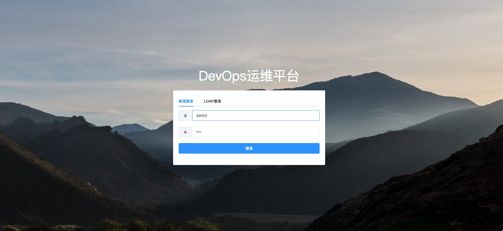
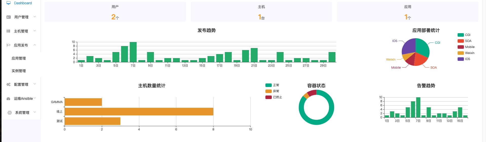
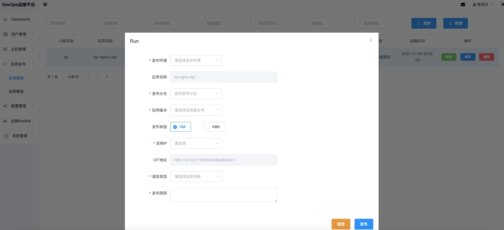
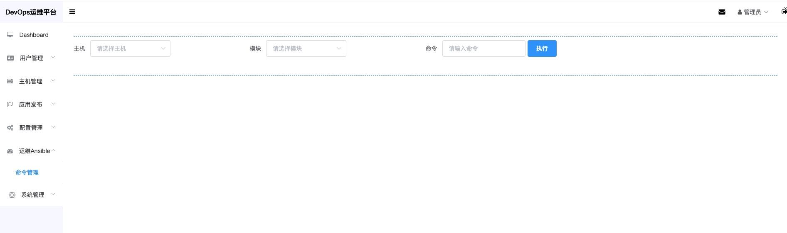
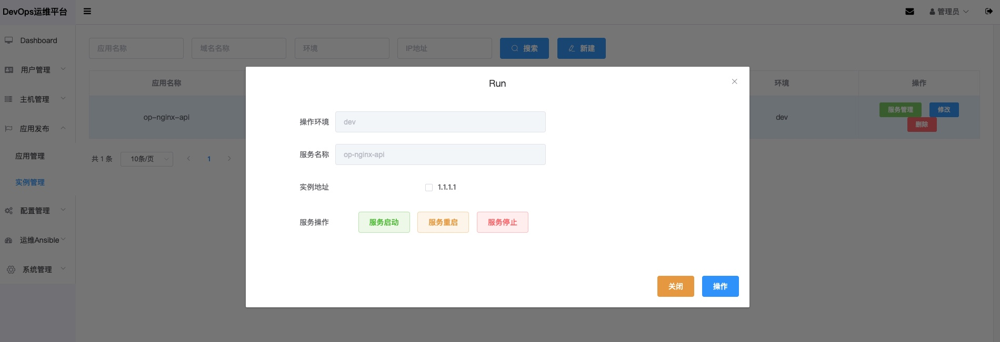

# op-devops-ui vue

> power by element-ui

## Environment

`Node >= 6`

## Start

 - Clone or download this repository
 - Enter your local directory, and install dependencies:

``` bash
npm install
```


## Build

``` bash
# build for production with minification
npm run build
```
## edit config
``` bash
#edit python-service api address
src/config/env.js
// 后端API接口地址
const envs = {
    apiServer: 'http://127.0.0.1:9000',
    request_timeout: 12000,
};

module.exports = envs;
```
## Develop

``` bash
# serve with hot reload at localhost:8010
npm run dev
```

## 功能列表













